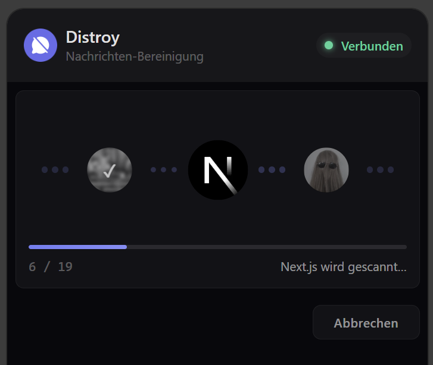

# Distroy

<p align="center">
  
</p>

Browser extension that bulk-deletes your Discord messages.

Exercise your GDPR Article 17 right to erasure. Discord doesn't offer this natively.

## How it works

1. **Open Discord** in your browser. Distroy captures your auth token from network traffic (never stored).
2. **Scan** to discover your messages across all servers and DMs.
3. **Select** which servers and conversations to clean.
4. **Delete** messages one by one, respecting rate limits.

Pause, resume, or cancel at any time. Progress is checkpointed so you can close the browser and pick up later.

## Install

### Chrome / Edge / Brave

Download the latest `.zip` from [Releases](../../releases), then:

1. Go to `chrome://extensions`
2. Enable **Developer mode** (top right)
3. Click **Load unpacked** and select the extracted folder

### Firefox

Download the Firefox `.zip` from [Releases](../../releases), then:

1. Go to `about:addons`
2. Click the gear icon and select **Install Add-on From File...**
3. Select the `.zip` file

## Build from source

Requires [Bun](https://bun.sh/) (or Node.js 18+).

```sh
bun install
bun run build          # Chrome (Manifest V3)
bun run build:firefox  # Firefox (Manifest V2)
```

## Features

- Scans all servers and DMs for messages
- Select individual servers and conversations
- Adaptive rate limiter that respects Discord's 429 responses
- Pause/resume with persistent checkpoints
- Real-time progress with ETA
- Failure triage (auth, permission, rate limit, network)
- Activity log
- Localized: English, German, French, Spanish

## Tech stack

- [WXT](https://wxt.dev/)
- [Svelte 5](https://svelte.dev/)
- [Tailwind CSS 4](https://tailwindcss.com/)
- TypeScript

## Disclaimer

This extension uses your Discord user token to interact with Discord's API on your behalf. It does not share, transmit, or store your token outside of your browser's session memory. Use at your own risk. Bulk message deletion may be subject to Discord's Terms of Service.

## GDPR Notice

This extension does not send anything to any server besides what is needed for its functionality.

## License

MIT Standard.
